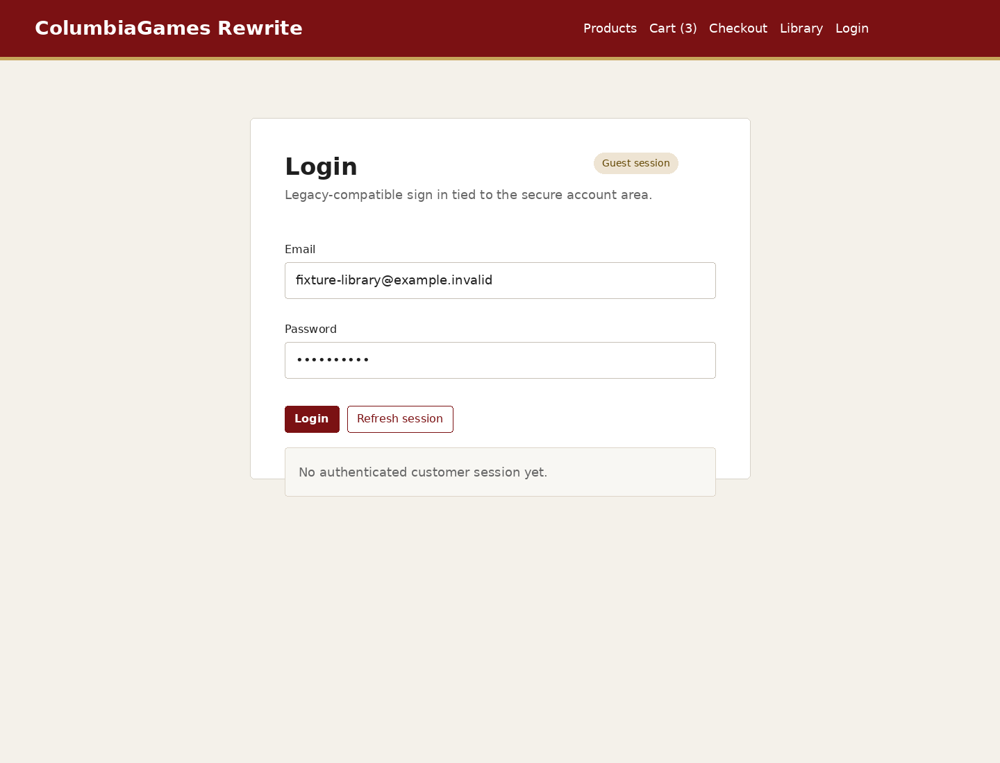
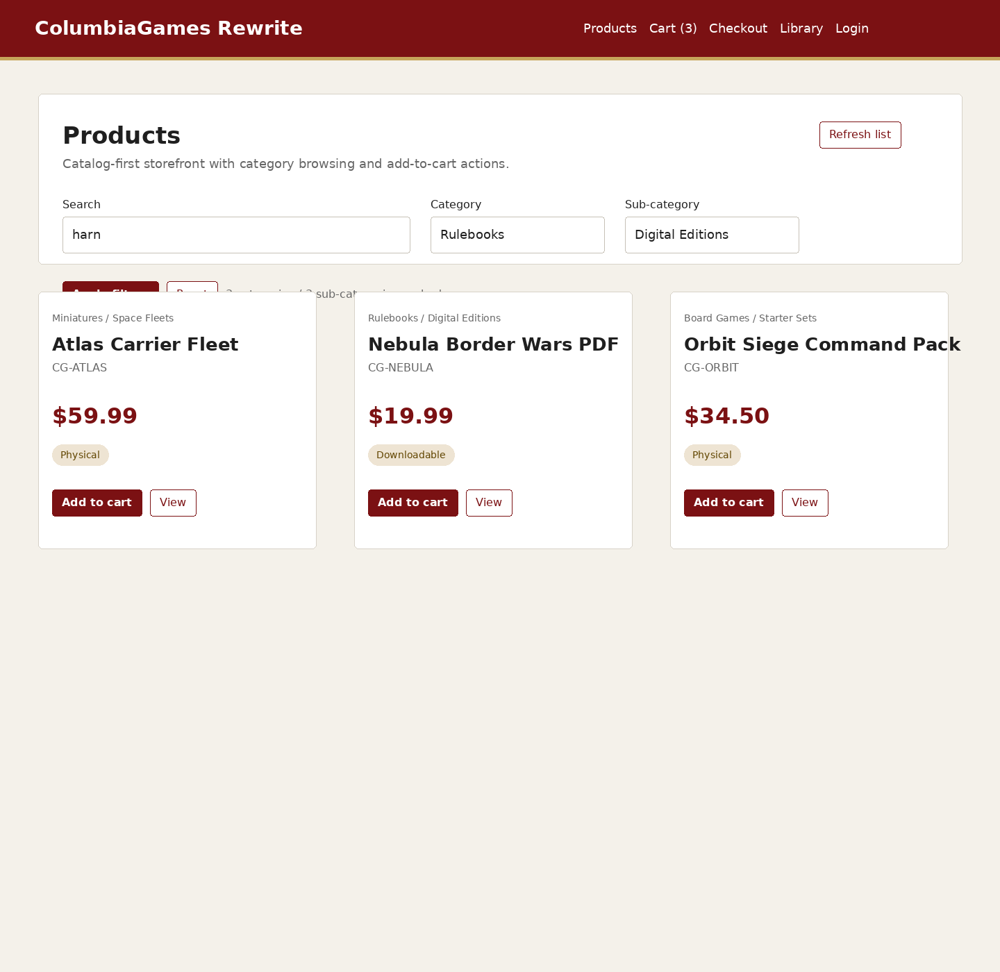
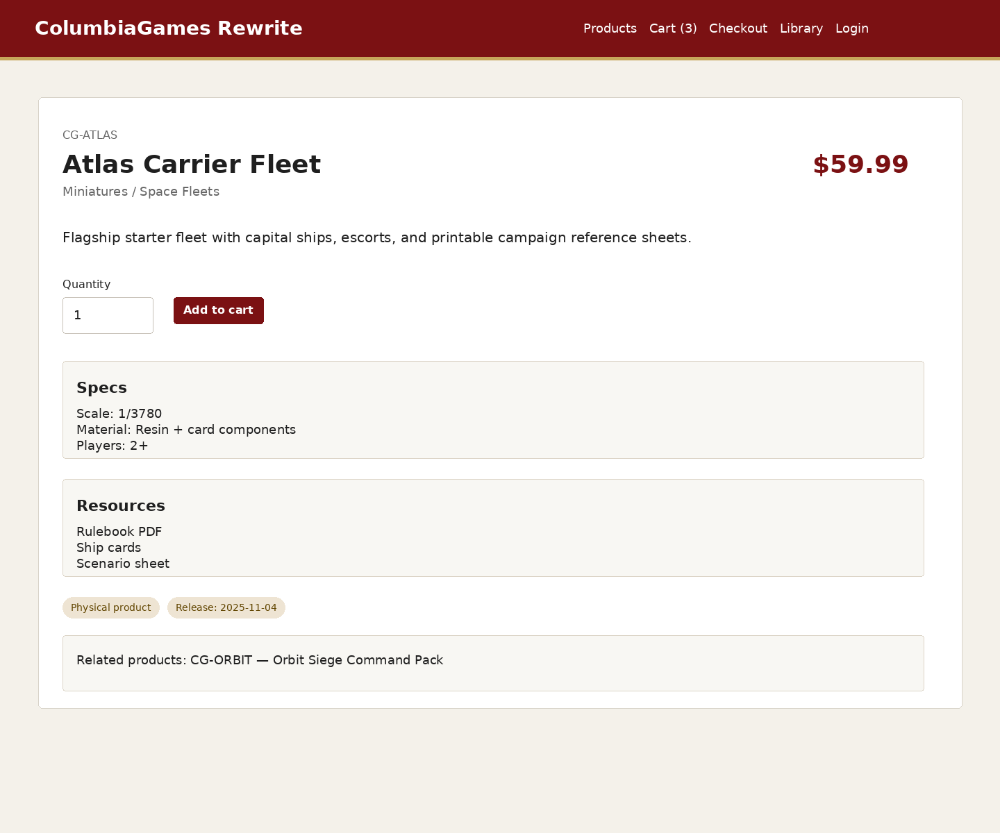
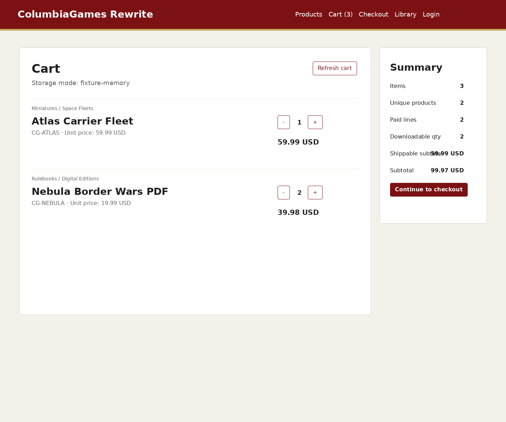
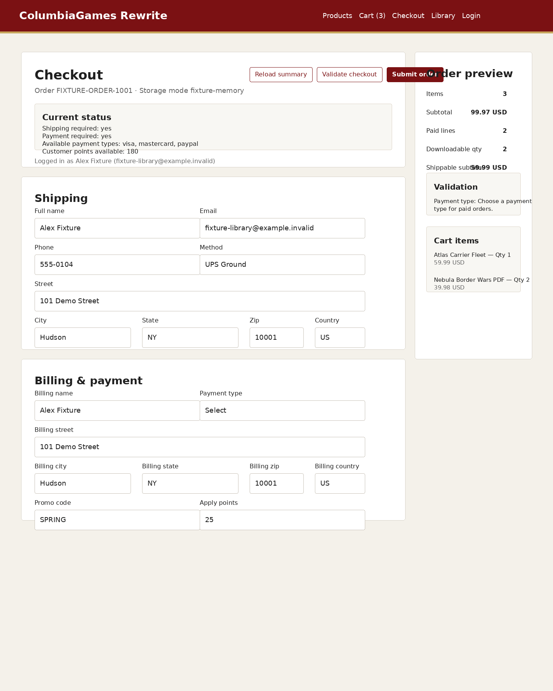
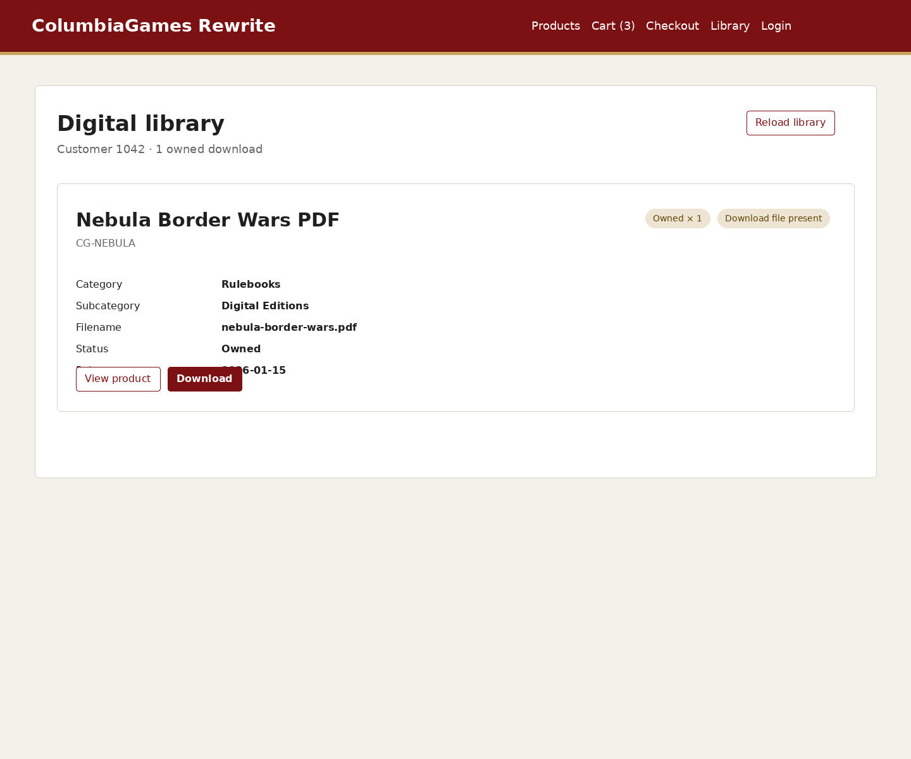

# UI Parity Inventory (CG-003)

This inventory now includes screenshot coverage for the six core storefront screens required by the ticket:

- login
- product list
- product detail
- cart
- checkout
- library

## Legacy cues captured from the current ColumbiaGames storefront

Based on the original login and product-list references the rewrite should preserve these broad cues during parity work:

- dark red header / account chrome
- dense, utilitarian navigation rather than a marketing-heavy hero layout
- plain white content panes with minimal decoration
- account and checkout views should remain operational and readable first, decorative second

These are guardrails, not pixel-perfect design requirements.

## Screen inventory

### 1. Login



**Purpose:** customer authentication against the legacy-compatible account bridge.

**Parity notes:** keep the screen simple, task-first, and clearly tied to the account area like the legacy login view.

### 2. Product list



**Purpose:** category-driven storefront landing view with search, category filtering, and add-to-cart access.

**Parity notes:** the rewrite may clean up spacing and typography, but it should still feel like a catalog-first product browser rather than a flashy promo page.

### 3. Product detail



**Purpose:** show one product, its price, supporting copy, and the immediate purchase action.

**Parity notes:** this screen should stay information-dense and commerce-oriented, similar to the original secure storefront pages.

### 4. Cart



**Purpose:** review line items, adjust quantities, and move the customer toward checkout.

**Parity notes:** totals and line-item clarity matter more than visual flourish.

### 5. Checkout



**Purpose:** collect shipping / billing details, expose validation state, and prepare the legacy order submit flow.

**Parity notes:** preserve a straightforward operational layout with strong form readability and visible order summary context.

### 6. Library



**Purpose:** show owned downloadable products and provide the post-purchase access point.

**Parity notes:** this should remain an account utility screen, not a re-skinned storefront.

## How screenshots are generated

The repository now includes a deterministic capture script that runs the frontend in fixture mode and exports the screenshots above:

```bash
node scripts/docs/capture-ui-parity.mjs
```

The script renders static fixture pages kept in the repository so the parity docs can be regenerated without a live database or active legacy cookies.
